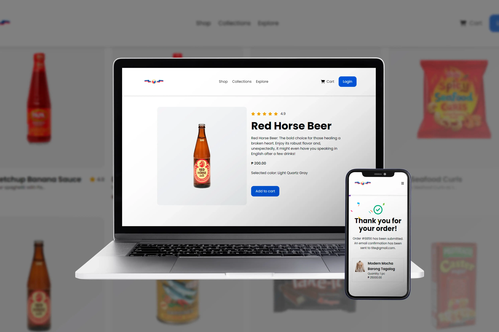
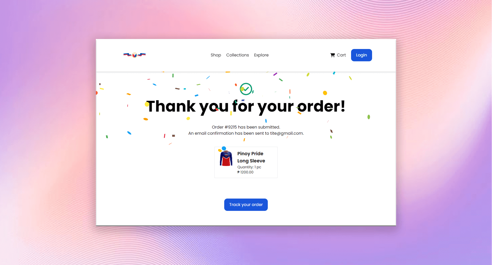
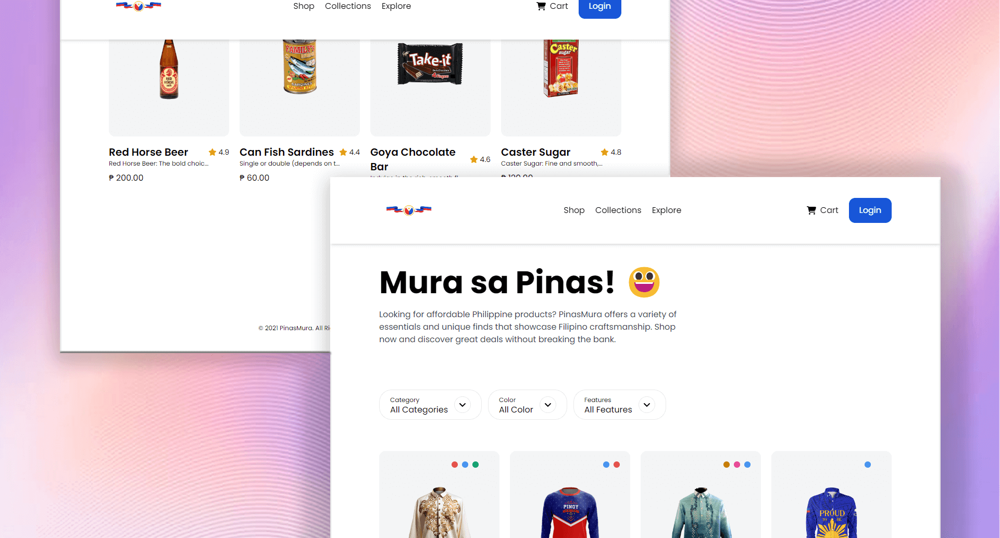
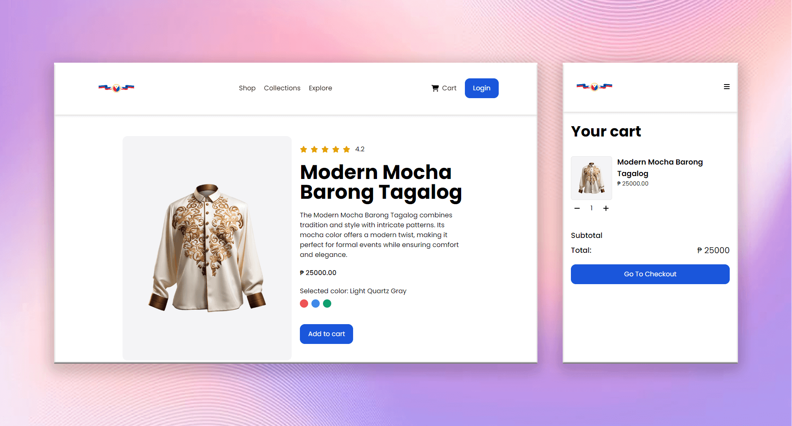
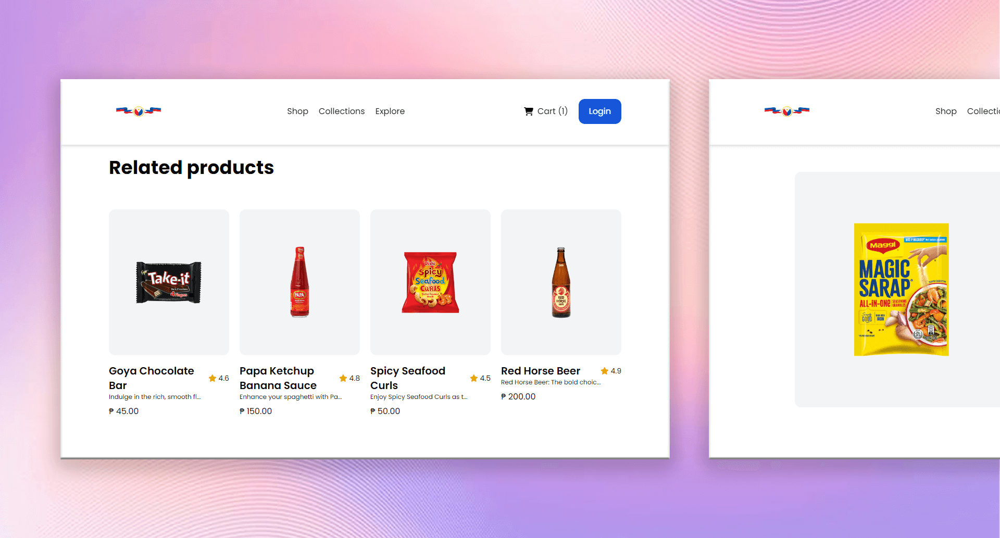

# PinasMura PH – fictional eCommerce for Philippine-made items

## 📌 Overview

PinasMura is a eCommerce platform that specializes in selling various Philippine-made items. From local handicrafts to popular food products, PinasMura aims to promote the culture and craftsmanship of the Philippines by providing a marketplace for locally sourced goods.

The platform offers a complete shopping experience with features such as product browsing, adding items to the cart, checking out, and managing orders. It also includes user account functionalities like registration and login to keep track of orders and preferences.

🔗 **Live Demo:** <a href="https://pinas-mura.vercel.app/" target="_blank">https://pinas-mura.vercel.app</a>

---

## ✨ Features

- User Registration & Login: Allows users to create accounts, log in, and manage their profiles and orders.
- Product Browsing: Provides an extensive catalog of Philippine-made products categorized for easy navigation.
- Add to Cart: Enables users to add items to their cart and manage them before making a purchase.
- Checkout System: Secure and straightforward checkout process for purchasing items.

---

## 🛠️ Technologies Used

**Frontend & Design:**

- HTML
- CSS
- JavaScript
- Tailwind CSS
- React.js
- PHP
- MySQL

**Design Tools:**

- Figma
- Adobe Photoshop
- Adobe XD

---

## 🖼️ Screenshots

|  |  |
| :--------------------------------------------------: | :--------------------------------------------------: |
|  |  |                                                |

---

## 📁 Project Type

- 🎨 Design
- 💻 Development

---

## 📂 Tags

- `Ecommerce`
- `Philippine-Products`
- `Cart-System`
- `Login-Register`
- `Order-Tracking`

## 🙋‍♂️ About the Developer

Hi! I’m **Wilhelmus**, a Full Stack Web Developer and Web Designer passionate about building impactful digital experiences.

- <a href="https://wilhelmus.vercel.app/?ref=github_pinasmura" target="_blank">Portfolio</a>
- <a href="https://www.linkedin.com/in/wilhelmusolejr/" target="_blank">LinkedIn</a>
